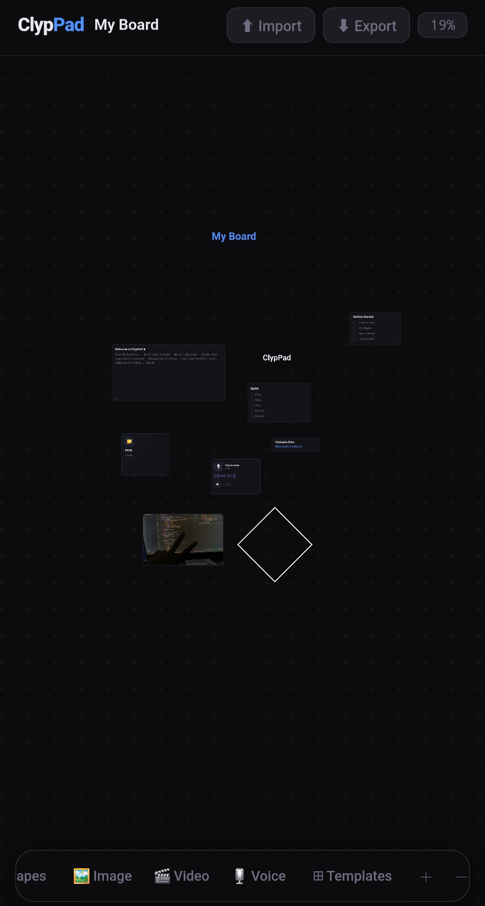

# Clyppad 

Clyppad is a local-first infinite canvas for notes, folders, shapes, and visual organization.

It runs entirely in the browser as a static web application.
No backend. No authentication. No external database.

Live Demo:
https://siv-the-programmer.github.io/Clyp-pad/

Repository:
https://github.com/siv-the-programmer/Clyp-pad

---

## Overview

Cli is built around three core ideas:

- Infinite zoomable canvas
- Unlimited nested folders
- Local-first data storage

Everything is stored in the browser using localStorage.
Each browser and device has its own isolated workspace.

There is no cloud sync and no server dependency.

---

## Features (v1.2)

### Canvas System

- Smooth pan and zoom (7% – 2000%)
- Zoom-to-cursor behavior
- Fit-to-content view
- Dynamic grid rendering
- Per-folder saved view state

### Structure

- Unlimited nested folders
- Breadcrumb navigation
- Back button navigation
- Independent layout per folder

### Content Types

Notes
- Full editor modal
- Auto-save
- Timestamp tracking
- Resizable cards

Folders
- Contain unlimited items
- Item count display
- Independent canvas state

Labels
- Custom text
- Adjustable size
- Custom color
- Zoom-safe rendering

Sticky Notes
- Color selection
- Timestamp
- Resizable

Checklists
- Toggleable items
- Completion state stored
- Visual strike-through

Links
- Clickable URLs
- Optional description
- Opens in new tab

Shapes
- Rectangle
- Circle
- Triangle
- Diamond
- Star
- Arrows
- Lines
- Brackets
- Adjustable fill color
- Adjustable stroke color
- Adjustable stroke width
- Resizable SVG rendering

# New features:

- Edit buttons — ✏ button on notes (footer), stickies (footer), and labels (top-right). Double-click also works
- Resize scales content — text inside notes, stickies, and checklists scales proportionally when you resize the card
- Label resize — drag corner changes font size live
- 2 Workspaces — Board 1 / Board 2 switcher in topbar, each has independent canvas and saves separately
- Screenshot — button with flash effect (uses OS screenshot as fallback since html2canvas needs hosting)
- Text editor for labels — edit button opens modal with size + color pickers
---

## Interaction System

- Drag and drop positioning
- Resize handles
- Right-click context menu
- Duplicate
- Rename
- Change color
- Delete
- Copy text
- Open folder

---

## Data Model

Data is stored as structured JSON including:

- Node registry
- Folder relationships
- Per-folder positioning
- Per-folder camera state

All persisted under a single localStorage key.

Export and import via JSON file is supported.

---

## Architecture

- Single HTML file
- Vanilla JavaScript
- No frameworks
- No external dependencies

Canvas rendering uses translation and scaling transforms with scale-aware drag and resize logic.

State persistence uses JSON serialization into localStorage with versioned schema control.

---

## Limitations

- Data is tied to browser and device
- Clearing browser storage removes data
- No collaboration
- No real-time sync
- Storage limited by browser quota
- Not optimized for extremely large datasets

---

## Roadmap

Active development continues.

Planned improvements include:

- Performance optimization for large boards
- Improved mobile interactions
- Search functionality
- Optional cloud sync layer
- Enhanced import/export versioning

---

## Version

Current: v1.2
Storage schema: v5
